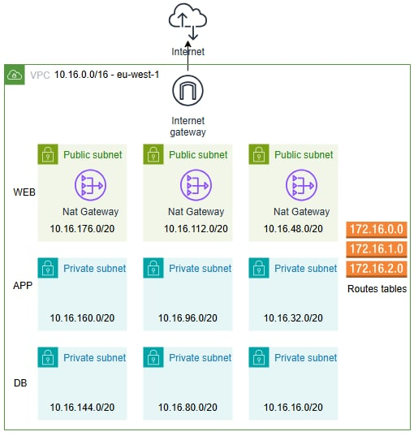

# Project-terraform-aws


## 1. Create a dev workspace
Run the following command
```
terraform workspace new dev
```

## 2. Provision all resources
```
terraform apply 
```

## 3. Destroy all resources
```
terraform Destroy 
```